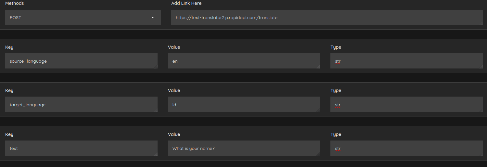

# API Testing
Gradio based API testing application.

# Headers
Copy your api headers in allocated area of running function.

# How to run?
```bash
git clone https://github.com/Drwaish/gradio_post.git
cd gradio_post
python3 gradio_post.py
```
# Example of gradio App
